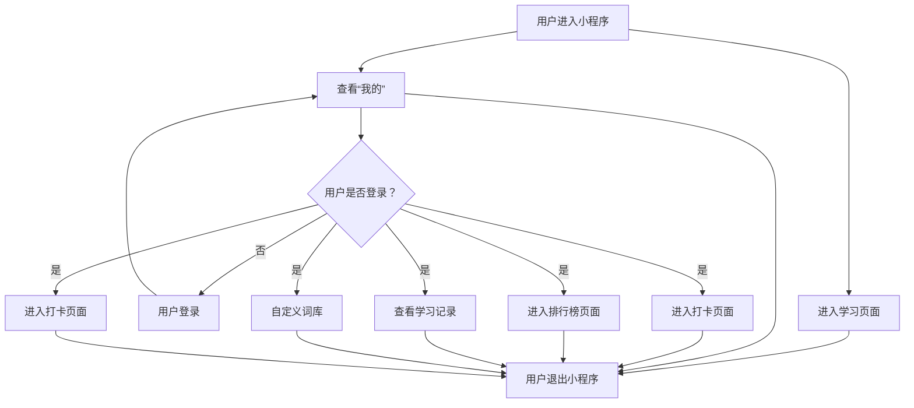
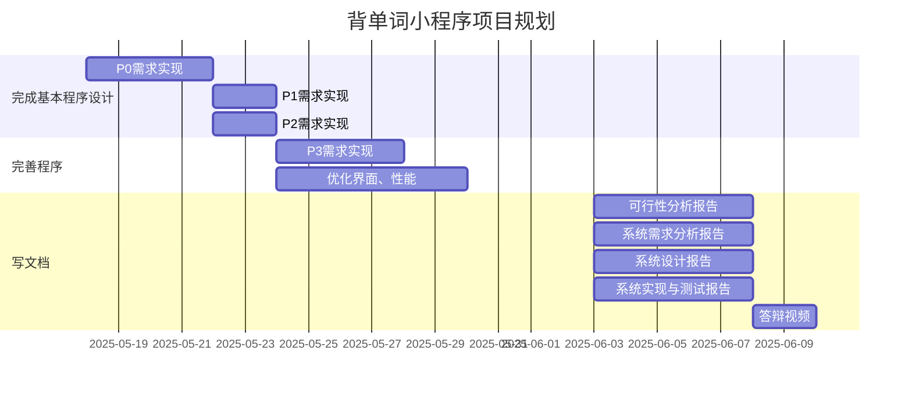

## 需求背景
### 用户调研
- 用户画像：在校大学生，对四六级英语学习有需求
- 用户痛点：
	- 单词遗忘
	- 重复学习熟悉的单词
	- 自身懒惰问题
### 竞品分析
####  [小鸡单词](https://github.com/flymysql/WeChat-applets)
这是一个可以根据用户记忆曲线安排用户每天学习计划的背单词小程序，并且依托微信这个巨大的流量平台已经在小程序流量平台发布，拥有了一定数量的用户

**这个背单词小程序有哪些特点？**
1. 根据用户记忆遗忘曲线安排每天的学习计划
2. 每天学习的细节比普通背单词程序更详细，用户可以实时看到自己每天忘记那些单词，熟悉那些单词
3. 用户自主选词，自己选择要背的单词，使用起来更主动
4. 功能齐全，市场背单词程序有的功能，在这个小程序上都有，可使用登陆备份等功能
5. 每个单词设置单词权重
6. 初始单词权重为0.5
7. 每忘记一次单词，会有相应的算法去减掉一定的权重
8. 会有排序算法将单词列表将单词按权重从低到高重新排列
9. 每天安排新的任务计划时，权重低的单词优先安排

#### [small 单词](https://github.com/zhanyeye/mini-word)
- 项目的起因是一个本科校级大创，目的是学习，提高实践能力
- 背单词和听写部分设计思路、页面样式来自了 [restress](https://github.com/restress) 的 [BallBall-Words](https://github.com/restress/BallBall-Words) 这个项目
- 参考的部分 `js` 逻辑重写，使用了扇贝api
- 改进了单词熟悉读的判断
- 使用微信小程序云开发

#### [求求单词](https://github.com/restress/BallBall-Words)
- 背单词、即用即抛。
- 单元形式分类。
- 可背单词、报听写、学语法。
- 可拓展其他语言包。

## 需求范围

| 功能点                 | 优先级 | 负责人 | 状态 |
| ------------------- | --- | --- | --- |
| 词库中随机选取单词并展示        | P0  | 古佳乐 | 完成 |
| 背诵单词统计              | P0  | 古佳乐 | 未完成 |
| 背诵单词历史记录            | P0  | 古佳乐 | 未完成 |
| 每日打卡、查看打卡记录         | P0  | 古佳乐 | 完成 |
| 用户登录                | P1  | 古佳乐 | 完成 |
| 背单词排行榜              | P1  | 古佳乐 | 未完成 |
| 用户自定义词库和选取单词        | P2  | 古佳乐 | 想摆烂 |
| 根据用户记忆遗忘曲线安排每天的学习计划 | P2  | 古佳乐 | 想摆烂 |
| 单词听写考查功能            | P3  |     |     |
### 所需页面
优先级根据对应功能点确认

| 页面名称     | 对应功能点                                     | 负责人 | 备注               |
| -------- | ----------------------------------------- | --- | ---------------- |
| 首页欢迎页面   |                                           | 古佳乐 |                  |
| 单词学习页面   | 词库中随机选取单词并展示、单词听写考查功能、根据用户记忆遗忘曲线安排每天的学习计划 | 古佳乐 | 若实现听写考察功能则添加一个页面 |
| 登录页面（我的） | 用户登录                                      | 古佳乐 |                  |
| 排行榜页面    | 背单词排行榜                                    | 古佳乐 |                  |
| 打卡页面     | 每日打卡、查看打卡记录                               | 古佳乐 |                  |
| 学习记录页面   | 背诵单词统计、背诵单词历史记录                           | 古佳乐 |                  |
| 选取单词页面   | 用户自定义词库和选取单词                              |     |                  |

## 功能详细说明
### 产品流程图

> 不强制用户登录使用程序是一种好的产品设计
### 交互原型图

### 功能说明

## 项目规划
